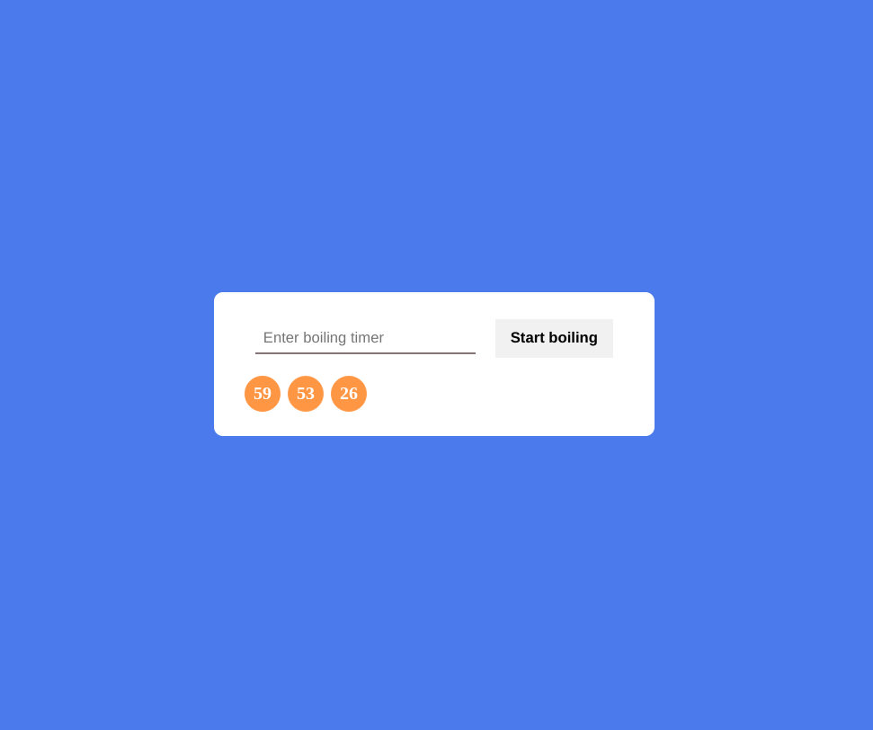

# Front Loops Challenges

Just discovered [Front Loops](https://www.frontloops.io) and checked out the 2 free challenges.

### Useful Resources

- [Image Color Picker](https://www.imagecolorpicker.com) - Get colors from design png
- [Florin Pop](https://www.florin-pop.com/blog/2019/03/css-pulse-effect/) - pulse effect
- [Stack Overflow](https://stackoverflow.com/questions/58598007/how-do-i-check-an-elements-direct-textcontent) - loop for textcontent
- [Stack Overflow](https://stackoverflow.com/questions/24775725/loop-through-childnodes) - looping childnodes
- [W3 Schools](https://www.w3schools.com/jsref/jsref_findindex.asp) - findIndex
- [Stack Overflow](https://stackoverflow.com/questions/31437211/remove-single-child-at-index) - remove child at index
- [Stack Overflow](https://stackoverflow.com/questions/6545379/can-we-directly-remove-nodes-from-a-nodelist) - remove nodes from nodelist
- [Stack Overflow](https://stackoverflow.com/questions/56007931/how-to-remove-child-elements-based-on-some-conditions-like-tag) - remove child elements based on condition
- [W3 Schools](https://www.w3schools.com/howto/howto_css_calendar.asp) - css calendar
- [Emmet](https://docs.emmet.io/abbreviations/syntax/) - emmet shortcuts
- [Unicode](https://unicode-table.com/en/00B0/) - degree unicode